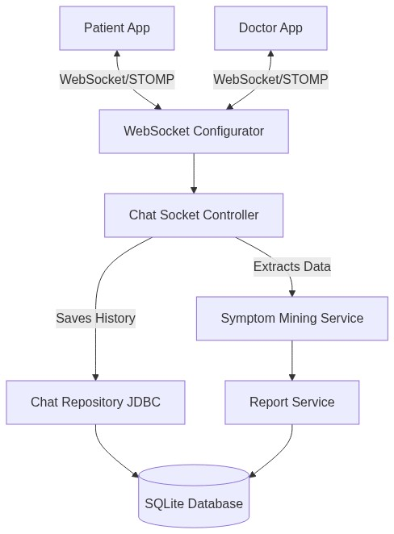

<div align="center">

# 🩺 PaAnaBot (Pre-Anamnesis Bot)

**An intelligent healthcare chat platform bridging the gap between Doctors and Patients.**

[](https://www.java.com/)
[](https://spring.io/projects/spring-boot)
[](https://www.sqlite.org/)
[](https://developer.mozilla.org/en-US/docs/Web/API/WebSockets_API)
[](https://jwt.io/)

[Features](#-key-features) •
[Tech Stack](#-tech-stack) •
[Getting Started](#-getting-started) •
[Architecture](#-architecture)

</div>

---

## 📖 About The Project

**PaAnaBot** is a real-time backend platform designed to streamline medical consultations. By facilitating instant communication between patients and healthcare professionals, it aims to perform **Pre-Anamnesis**—gathering preliminary medical histories and identifying potential symptoms before the actual clinical consultation begins.

Using a custom **Symptom Mining Engine**, the system analyzes patient interactions, extracts vital health indicators, and compiles automated medical reports for doctors.

---

## ✨ Key Features

- **🔐 Secure Role-Based Auth:** Robust JWT (JSON Web Token) authentication separating Doctor and Patient workflows.
- **💬 Real-Time Messaging:** Instant, bidirectional communication powered by WebSockets (STOMP).
- **🧠 Symptom Mining Engine:** Analyzes chat histories to intelligently mine and rank patient symptoms.
- **📊 Interactive Dashboards:** Personalized data feeds and statistics for both healthcare providers and patients.
- **🧾 Automated Reports:** Seamless generation and tracking of medical reports directly linked to chat sessions.

---

## 🛠 Tech Stack

This project is built using modern Java full-stack technologies:

* **Core:** Java, Spring Boot
* **Security:** Spring Security, JWT (JSON Web Tokens)
* **Real-Time Communication:** WebSockets, STOMP protocol
* **Database:** SQLite (JDBC)
* **Build Tool:** Maven

---

## 🚀 Getting Started

To get a local copy up and running, follow these simple steps.

### Prerequisites
* **Java Development Kit (JDK):** Version 17 or higher
* **IDE:** VS Code
* **Git**

### Installation

1. **Clone the repository**
   ```bash
   git clone https://github.com/tsumith/pre-anamnesis.git
   cd pre-anamnesis
   ```

2. **Configure Database (Optional)**
   The project is pre-configured to initialize an SQLite database locally. Any custom overrides can be done inside `src/main/resources/application.properties`.

3. **Run the Application**
   Run the `PaAnaBotApplication` main class from your IDE or use the spring-boot maven plugin:
   ```bash
   ./mvnw spring-boot:run
   ```

4. **Connect via WebSocket**
   The WebSocket endpoint is exposed at `ws://localhost:8080/ws` and topics are prefixed with `/topic/`.

---

## 🏗 Architecture 

Here is a high-level overview of how the PaAnaBot system handles real-time consultation:

